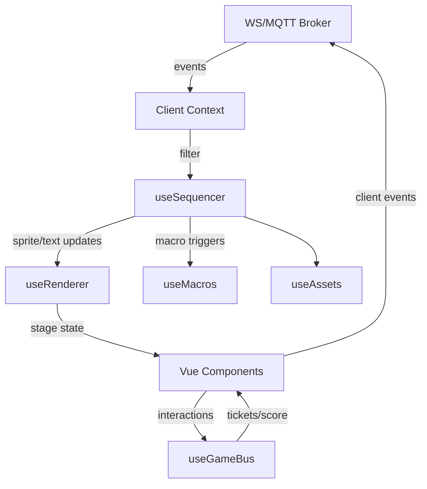

# Arena Pixel Client

Nuxt 4-baserad pixelklient för arenashower med PixiJS-rendering, interaktiva moduler och orkestrering via WebSocket/MQTT.

## Snabbstart
Nuxt 4 + PixiJS-baserad arena pixelklient med interaktiva moduler, timeline och PWA-stöd.

## Utveckling

```bash
npm install
npm run dev
```

Öppna sedan `http://localhost:3000` i valfri webbläsare.

## Arkitektur i korthet

| Lager | Huvudmoduler | Ansvar |
| --- | --- | --- |
| Presentationslager | Vue-komponenter i `app/components` och `app/pages` | UI-flöden (join, debug), spelmoduler (Quiz, ScratchCard, BeatGame) och scenvisualisering via `PixelStage` |
| Tillstånd & orkestrering | Pinia-store `app/stores/appState`, composables `useGameBus`, `useAddressing`, `useClock` | Lokal state, gamification-poäng, klientadressmatchning och tidsynk |
| Renderingsmotor | `useRenderer`, `useSequencer`, `useMacros`, `useAssets` | PixiJS-app, Canvas fallback, scenmanifester, timeline-sampling och makroeffekter |
| Integrationer | `app/plugins/ws.client`, `app/plugins/pwa.client`, `public/sw.js`, `public/manifest.webmanifest` | Orkestreringsklient (WebSocket/MQTT), PWA-registrering, telemetri och caching |

### Dataflöde

1. **Orkestrering** – `useWs` prenumererar på händelser och distribuerar dem via event-typ (`sequencePlay`, `cmdSprite`, `prizeDraw` osv.).
2. **Adressfiltrering** – inkommande händelser körs genom `matchesAE` för att säkerställa att de riktas till den aktuella klientens kontext.
3. **Sekvensering** – `useSequencer` spelar timeline-data och uppdaterar bakgrunder, sprites och texter via `useRenderer`.
4. **Makron** – timeline-tracks `macro.*` eller manuella triggers kallar `useMacros` för effekter (pulseColor, shake, orbit, flash, typewriterText).
5. **Spel och gamification** – UI-komponenter skickar användarinteraktioner via `useGameBus` och `useWs` (quiz-svar, scratch-reveal, beat score). Ticket-ökning triggar PrizeDraw-overlay.
6. **Telemetri** – `pwa.client.ts` samplar fps/rtt och skickar beacons var 5:e sekund.

## Modulöversikt

### Komponenter (`app/components`)
- **PixelStage.client.vue** – monterar PixiJS eller Canvas2D-fallback och visar show-scen.
- **ConnectionIndicator.vue** – visar realtidsstatus för orkestreringsanslutningen.
- **ui/QuizClient.vue** – multiple-choice-gränssnitt med tidsbegränsning och validering.
- **ui/ScratchCard.client.vue** – canvas-mask som frilägger bild och signalerar när gränsen är uppnådd.
- **ui/BeatGame.client.vue** – rytmspel som jämför taps mot beat-grid och rapporterar poäng.

### Composables (`app/composables`)
- **useAddressing** – Address Expression-DSL med stöd för zon, sektion, rad, party, ticket och capabilities.
- **useAssets** – manifest-baserad asset-preload och texturåtkomst.
- **useClock** – kapslar `useWs.showTime()` för lokal/orkestrerad tid.
- **useGameBus** – enkelt eventbuss-API för lokal score- och ticket-hantering.
- **useMacros** – registrerar makron (pulseColor, shake, orbit, flash, typewriterText) och exekverar dem med delad kontext.
- **useRenderer** – PixiJS-app med Canvas2D-fallback, sprite/text lifecycle och prop-uppdateringar.
- **useSequencer** – timeline-sampling (easing, färginterpolering) och dispatch till renderer/makrosystem.

### Plugins och infrastruktur
- **app/plugins/ws.client.ts** – robust orkestreringsklient (WebSocket eller MQTT) med reconnect, heartbeat och tidsynk.
- **app/plugins/pwa.client.ts** – registrerar service worker och skickar telemetri-beacons.
- **app/plugins/pixi.client.ts** – gör PixiJS tillgängligt och säkerställer BatchRenderer-registrering.
- **public/sw.js & manifest.webmanifest** – cache-strategi och PWA-metadata.

### Typer och tester
- **types/** – händelse-, timeline- och makrodefinitioner för typad kommunikation.
- **tests/** – Vitest-specar som verifierar addressing-predikat och timeline-sampling.

## Systemdesign



## Miljövariabler

Skapa `.env` med:

```
WS_URL=wss://example.com/show
SHOW_ID=demo
```

## Scripts

- `npm run dev`
- `npm run build`
- `npm run preview`
- `npm run lint`
- `npm run format`
- `npm run test`

## Testning

```bash
npm run test
```

## Felsökning

- Kontrollera konsolen för WebSocket/MQTT-fel; klienten faller tillbaka på mock-läge när `WS_URL` saknas.
- Använd `/debug`-sidan för att spela demo-timeline, utlösa makron och testa minispel lokalt.
